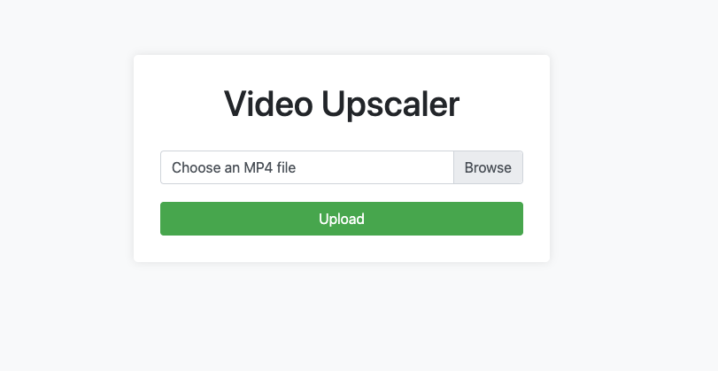

# NCNN Video Upscaler (Linux)

This is a Flask web application that allows users to upload MP4 video files and upscale them using the RealESRGAN-NCNN-Vulkan algorithm. The upscaled video is then saved with the `.out.mp4` extension.

## Prerequisites

- Python 3.x
- FFmpeg
- RealESRGAN-NCNN-Vulkan

## Installation

1. Clone the repository:
```bash
git clone https://github.com/your-repo/ncnn-video-upscaler.git
```
2. Create and activate a virtual environment (optional but recommended):
```bash
python3 -m venv venv
source venv/bin/activate
# On Windows, use venv\Scripts\activate
``` 
3. Install the required Python packages:
```bash
pip install -r requirements.txt
```
4. Download and install FFmpeg.
```bash
sudo apt install ffmpeg
```

## Usage

1. Run the Flask application:
```bash
python main.py
```

2. Open your web browser and navigate to http://localhost:8000.

3. On the upload page, click the "Choose File" button and select an MP4 video file.
4. Click the "Upload" button to start the video processing.
5. Wait for the video processing to complete. Once the processing is complete, you will be redirected to a download page where you can download the upscaled video.

## Configuration

You can configure the following settings in the `main.py` file:

- `ALLOWED_EXTENSIONS`: A set of allowed file extensions for video uploads (default: `{'mp4'}`).
- `MAX_FILE_SIZE`: The maximum file size in MB for video uploads (default: `100`).
- `UPLOAD_FOLDER`: The path to the folder where uploaded videos will be stored (default: `'uploads'`).
- `OUTPUT_FOLDER`: The path to the folder where processed videos will be stored (default: `'output'`).

## License

This project is licensed under the [MIT License](LICENSE).